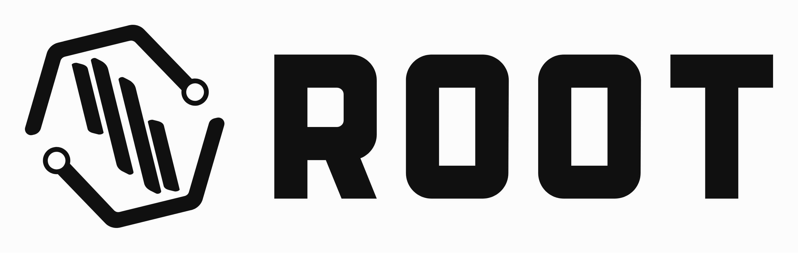
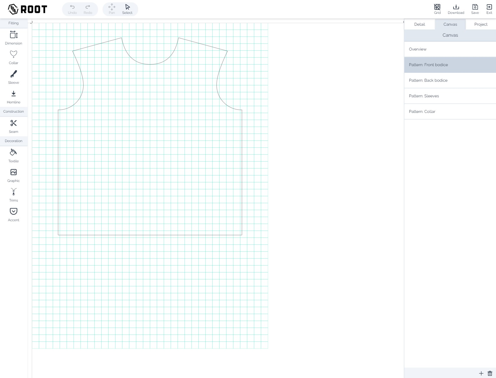

# Digital Pattern CAD - Full-Stack Fashion Design Application

> **Note**: This is a showcase repository for a passion project built in 2023. The application is no longer live and source code is not publicly available. This repository demonstrates the project's capabilities, architecture, and learning outcomes.

<div align="center">
  
  
  ### ✂️ Democratizing Digital Fashion Design
  
  [](https://nextjs.org/)
  [](https://nestjs.com/)
  [](https://www.typescriptlang.org/)
  [](https://www.mongodb.com/)
  [](http://paperjs.org/)
</div>

---

## 🎥 Demo Video

<div align="center">
  <a href="https://youtu.be/bwhhytO7jE0">
    
  </a>
  <p><em>Click to watch the full demo showcasing the complete workflow from template selection to pattern export</em></p>
</div>

---

## 🎯 Project Overview

A self-directed passion project developed over several months to explore the intersection of fashion design and web technology. This full-stack web CAD application aimed to lower the technical barriers in digital patternmaking and make fashion development more accessible to creators of all skill levels.

### 🎭 The Vision

Traditional patternmaking software often requires extensive training and expensive licenses. This project explored whether modern web technologies could deliver a more intuitive, accessible solution for digital garment pattern creation.

### 🎓 Learning Objectives

1. **Fundamental understanding of 2D computer graphics** and the mathematics behind interactive digital design tools
2. **Exploring accessibility in fashion tech** by reducing the technical complexity of digital patternmaking
3. **Full-stack architecture implementation** with modern JavaScript frameworks
4. **Complex state management** for real-time collaborative design tools

---

## ✨ Key Features

### 🎨 Design Workflow

#### 1. Template-Based Starting Point
- Library of professional base blocks (bodice, sleeve, skirt, etc.)
- Industry-standard pattern foundations
- Quick-start options for common garment types

#### 2. Parametric Adjustments
- Real-time dimension modifications
- Intelligent ease calculations
- Proportional scaling algorithms
- Size grading capabilities

#### 3. Style Customization
- Visual design detail modifications
- Interactive neckline shaping
- Hemline adjustments
- Collar and cuff variations
- Pocket placement tools

#### 4. Digital Pattern Editing
- Professional CAD tools:
  - ✂️ Cut and split tools
  - 📐 Measurement tools
  - 🔄 Rotation and transformation
  - 📍 Notch and marking placement
  - 🔗 Piece relationship management

#### 5. Production Features
- **1-Click Seam Allowances**: Automatic generation with customizable widths
- **Grainline Management**: Automatic and manual grainline placement
- **Pattern Labeling**: Automatic piece naming and cutting instructions

#### 6. Export Capabilities
- **Real-Size PDF Export**: Print-ready patterns at 1:1 scale
- **Tiled PDF Options**: For home printing on letter/A4 paper
- **DXF Export**: Compatible with industrial cutting machines
- **Pattern Instructions**: Generated cutting layouts and assembly guides

### 👗 Visualization Features

#### 2D Fabric Simulation
- Textile assignment to pattern pieces
- Artwork and print placement
- Color variations
- Basic drape visualization

#### Pattern Preview
- Real-time updates as you design
- Multiple view options
- Measurement overlay
- Construction line visibility toggle

---

## 🛠️ Technical Architecture

### Frontend Stack
```
├── Framework: Next.js with React
├── Language: TypeScript
├── State Management: Redux + Redux Toolkit
├── 2D Graphics Engine: Paper.js
├── Styling: Styled Components
├── API Communication: Axios
└── Build Tools: Webpack, Babel
```

### Backend Stack
```
├── Framework: NestJS
├── Language: TypeScript
├── Database: MongoDB with Mongoose
├── Authentication: Passport.js (JWT)
├── File Storage: Cloud Storage (S3-compatible)
├── PDF Generation: Custom PDF engine
└── API: RESTful architecture
```

### Key Technical Implementations

#### 2D Graphics Engine
- **Paper.js Integration**: Custom wrapper for React compatibility
- **Vector Mathematics**: Bezier curve calculations for smooth pattern curves
- **Collision Detection**: For pattern piece overlap prevention
- **Zoom & Pan**: Infinite canvas with smooth navigation

#### State Management
- **Redux Architecture**: Centralized state for complex pattern data
- **Undo/Redo System**: Complete action history with state snapshots
- **Real-time Collaboration**: WebSocket integration for live updates
- **Persistent Storage**: Auto-save functionality with conflict resolution

#### Performance Optimizations
- Canvas rendering optimizations for smooth 60fps interactions
- Efficient geometric calculations using spatial indexing
- Lazy loading of pattern templates and assets
- Web Workers for heavy computational tasks

---

## 📊 Technical Challenges & Solutions

### Challenge 1: Precise Geometric Operations
**Problem**: Fashion patterns require millimeter precision for proper fit.
**Solution**: Implemented custom geometric algorithms with sub-pixel accuracy and constraint-based modeling.

### Challenge 2: Real-time Performance
**Problem**: Complex patterns with many pieces caused lag.
**Solution**: Implemented virtual viewport rendering and efficient diff algorithms for selective redraws.

### Challenge 3: PDF Generation Accuracy
**Problem**: Ensuring 1:1 scale accuracy across different printers.
**Solution**: Developed calibration system and extensive testing across printer models.

### Challenge 4: User Experience for Non-Technical Users
**Problem**: Making CAD tools accessible to users without technical training.
**Solution**: Progressive disclosure UI pattern with contextual tutorials and visual feedback.

---

## 🏗️ System Architecture

```
┌─────────────────────────────────────────────────────────────────┐
│                          Client Browser                         │
├─────────────────────────────────────────────────────────────────┤
│                      Next.js Application                        │
│  ┌──────────────┬──────────────┬──────────────┬─────────────┐ │
│  │    Pages     │  Components  │    Redux     │   Paper.js  │ │
│  │              │              │    Store     │   Canvas    │ │
│  └──────────────┴──────────────┴──────────────┴─────────────┘ │
├─────────────────────────────────────────────────────────────────┤
│                        API Gateway                              │
├─────────────────────────────────────────────────────────────────┤
│                      NestJS Backend                             │
│  ┌──────────────┬──────────────┬──────────────┬─────────────┐ │
│  │   Auth       │   Patterns   │    Users     │   Export    │ │
│  │   Module     │   Module     │    Module    │   Module    │ │
│  └──────────────┴──────────────┴──────────────┴─────────────┘ │
├─────────────────────────────────────────────────────────────────┤
│  ┌──────────────────────────┬──────────────────────────────┐  │
│  │       MongoDB            │        File Storage          │  │
│  └──────────────────────────┴──────────────────────────────┘  │
└─────────────────────────────────────────────────────────────────┘
```

---

## 🔍 Core Workflows

### User Registration & Authentication
1. Secure signup with email verification
2. JWT-based authentication
3. Role-based access control
4. Password recovery system

### Pattern Creation Workflow
1. **Template Selection** → Choose base pattern
2. **Measurements Input** → Enter body measurements
3. **Parametric Adjustments** → Modify ease and proportions
4. **Style Customization** → Adjust design details
5. **Pattern Editing** → Fine-tune with CAD tools
6. **Finishing** → Add seam allowances and notches
7. **Export** → Generate PDF or DXF files

### Collaboration Features
- Pattern sharing with permission controls
- Version history and branching
- Comments and annotations
- Public pattern library

---

## 💡 Lessons Learned

### Technical Insights
1. **2D Graphics Performance**: Browser-based CAD requires careful optimization
2. **Precision vs Performance**: Balancing accuracy with responsive UI
3. **State Complexity**: Pattern data structures grow exponentially
4. **Cross-browser Compatibility**: Canvas rendering varies significantly

### Product Insights
1. **User Onboarding**: Technical tools need exceptional UX
2. **Feature Creep**: Importance of MVP focus
3. **Domain Knowledge**: Deep understanding of patternmaking essential
4. **Community Building**: User feedback drove best features

### Personal Growth
1. **Full-Stack Mastery**: End-to-end ownership deepened understanding
2. **Computer Graphics**: Mathematical foundations proved invaluable
3. **System Design**: Architecture decisions impact long-term maintainability
4. **Product Thinking**: Technical excellence must serve user needs

---

## 🚀 Future Vision

While this specific implementation is no longer active, the project explored important concepts that could shape the future of fashion technology:

### Potential Enhancements
- **3D Visualization**: Integration with WebGL for garment preview
- **AI Pattern Generation**: ML-based pattern suggestions
- **Mobile Support**: Touch-optimized pattern editing
- **Manufacturing Integration**: Direct-to-factory workflows
- **Sustainability Features**: Fabric optimization algorithms

### Industry Impact
The project demonstrated that web technologies can deliver professional CAD capabilities, potentially democratizing access to digital fashion tools and enabling a new generation of independent designers.

---

## 🛠️ Technologies Deep Dive

### Paper.js Implementation
- Custom React bindings for Paper.js
- Efficient redraw cycles with dirty region tracking
- Complex path operations for pattern manipulation
- Custom tools for fashion-specific operations

### State Management Architecture
- Normalized pattern data structure
- Immutable updates for undo/redo
- Optimistic UI updates
- Conflict-free replicated data types (CRDT) exploration

### Authentication & Security
- JWT with refresh token rotation
- Rate limiting and DDoS protection
- Input validation and sanitization
- Secure file upload pipeline

---

## 📚 Resources & Inspiration

### Technical References
- Paper.js documentation and examples
- Computational geometry algorithms
- CAD software architecture patterns
- Real-time collaboration techniques

### Fashion Industry Research
- Traditional patternmaking methods
- Industry standard measurements
- Garment construction techniques
- Digital transformation in fashion

---

<div align="center">
  <sub>Built with passion for fashion technology and software craftsmanship</sub>
  <br>
  <sub>#FashionTech #DigitalFashion #PatternMaking #CAD #FullStack #NextJS #NestJS #PaperJS</sub>
</div>

---

**📝 Note**: This project was a personal learning journey and is no longer in active development. The repository serves as a portfolio piece and technical reference for similar initiatives in fashion technology.
